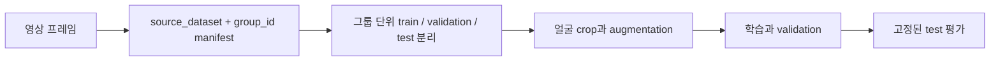
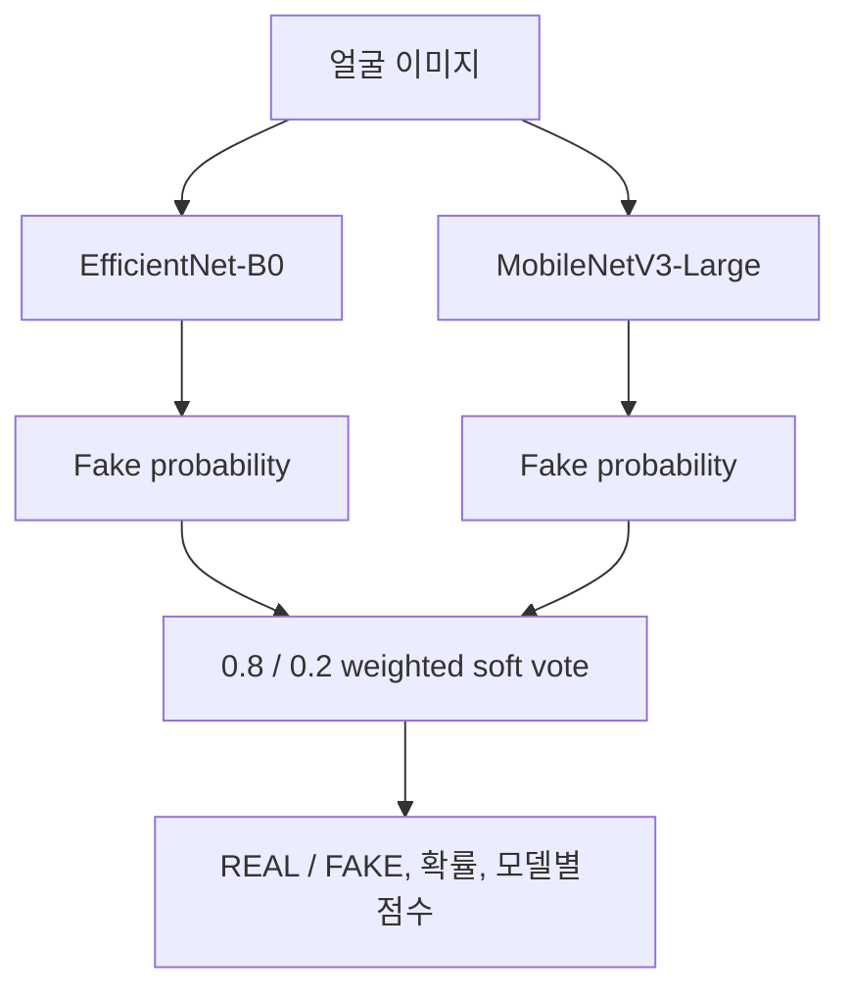

# TruthLens
## CNN으로 딥페이크를 구분해 보려다, 데이터와 평가 설계의 문제를 만난 모델링 기록

> **처음 목표는 단순했습니다.** 얼굴 이미지에서 REAL과 FAKE를 구분하는 CNN 모델을 직접 만들어 보자는 것이었습니다. 개발을 진행하면서 작은 표본, 프레임 중복, 도메인 차이 때문에 점수 하나만으로 모델을 설명할 수 없다는 사실을 확인했습니다. 이 저장소는 그 과정과 다음 실험을 남긴 AI 모델 파트 기록입니다.

## 한눈에 보기

| 구분 | 내용 |
| --- | --- |
| 처음 목표 | CNN 기반 얼굴 이미지 분류기로 딥페이크 판별 흐름 구현 |
| 개발 중 발견 | 프레임 무작위 분할과 작은 데이터가 과적합·누수처럼 보이는 문제를 만들 수 있음 |
| 직접 맡은 범위 | 데이터 인덱싱, 학습·평가, 앙상블 추론, 백엔드 연결용 Python 인터페이스 |
| 구현 모델 | EfficientNet-B0, MobileNetV3-Large, weighted soft voting |
| 현재 상태 | 교육·연구용 프로토타입 |
| 보존된 기록 | DeepFake-Eval-2024 EfficientNet-B0 fine-tuning, validation ROC-AUC **0.6731**, accuracy **0.6272** |

---

## 1. 출발점: CNN으로 딥페이크를 구분해 보자

TruthLens의 AI 모델 파트는 “얼굴 이미지 한 장을 입력하면 CNN이 REAL과 FAKE를 구분할 수 있을까?”라는 질문에서 시작했습니다. EfficientNet-B0와 MobileNetV3-Large를 구성하고, 얼굴 crop부터 모델 점수 반환까지 하나의 추론 흐름을 구현했습니다.

처음에는 모델 구조와 학습 옵션을 조정하는 데 집중했습니다. 하지만 실험을 반복하면서, **모델을 더 복잡하게 만드는 일보다 데이터가 어떻게 나뉘고 결과가 어떻게 기록되는지가 더 먼저**라는 문제를 만났습니다.

| 개발 단계 | 처음 생각 | 구현하면서 확인한 문제 | 이후 대응 |
| --- | --- | --- | --- |
| 데이터 준비 | 프레임 수를 늘리면 학습 데이터가 늘어난다 | 같은 영상의 유사 프레임은 독립 표본이 아니다 | 원본 영상 그룹 단위 split |
| 학습 | epoch를 더 돌리면 성능이 오를 수 있다 | train 점수만 오르고 validation은 정체할 수 있다 | 전이학습, regularization, early stopping |
| 평가 | accuracy 하나로 비교한다 | threshold·분할·도메인에 따라 해석이 달라진다 | validation 전용 threshold, test 고정 |
| 앙상블 | 모델을 합치면 더 좋아질 수 있다 | 가중치와 일반화 우수성을 자동으로 증명하지 않는다 | 구현 설정과 검증된 결과를 분리 |

---

## 2. 왜 결과가 높지 않았는가

보존된 실행에서 validation accuracy는 **0.6272**, ROC-AUC는 **0.6731**입니다. 취업 포트폴리오에서 “높은 탐지 성능”이라고 제시할 수 있는 수치가 아닙니다. 이 프로젝트에서 중요한 것은 낮은 결과를 감추지 않고, 그 원인을 분석하고 다음 실험으로 연결한 점입니다.

### 제한된 독립 표본

기록상 학습에는 최대 200개 train 영상에서 영상당 8프레임을 사용했습니다. 즉 최대 약 1,600장의 train 프레임 수준이며, 같은 원본 영상 안의 프레임은 서로 매우 비슷합니다. 프레임 숫자가 몇 천 장처럼 보여도 수천 장의 독립적인 얼굴 사례와는 다릅니다.

### 데이터셋·도메인 차이

Celeb-DF, DFDC, DeepFake-Eval-2024는 촬영 환경, 압축률, 인물 구성, 위조 방식이 다릅니다. 한 데이터셋에서 본 압축 노이즈나 배경 패턴을 학습하면 다른 출처에서 성능이 흔들릴 수 있습니다.

### 작은 데이터에서의 과적합

보존된 기록에서는 train accuracy가 0.6003에서 0.8953까지 상승했지만 validation ROC-AUC는 epoch 3의 0.6731 이후 0.6720, 0.6726 수준에 머물렀고 validation loss는 증가했습니다. 더 오래 학습하는 것만으로 일반화가 개선되지 않았다는 신호입니다.

### 연산·저장 환경의 제약

대규모 원본 영상을 반복 학습하고, 여러 seed와 데이터셋 조합을 충분히 반복할 GPU 시간·저장 공간이 없었습니다. 그 환경에서 수치만 올리기보다, 제한을 코드와 문서에 남기는 쪽을 선택했습니다.

---

## 3. 데이터와 평가 구조

### 프레임 수보다 원본 영상 단위의 독립성을 우선

manifest는 이미지 파일만 나열하지 않고 데이터셋과 원본 영상 정보를 함께 보존합니다.

| 필드 | 역할 |
| --- | --- |
| `image_path` | 추출 프레임 위치 |
| `label` | REAL = 0, FAKE = 1 |
| `source_dataset` | Celeb-DF, DFDC 등 출처 구분 |
| `group_id` | 같은 원본 영상의 식별자 |
| `split` | train / validation / test |

`source_dataset + group_id`를 하나의 분할 단위로 관리합니다. 같은 그룹이 두 split에 들어가면 테스트가 실패하도록 구성했습니다. 손상 이미지를 검은 이미지로 대체하지 않고 제외하는 이유도, 인공적인 검은 패턴이 label과 결합하는 일을 막기 위해서입니다.



### threshold는 validation에서만 선택

기본 판정 threshold는 0.5입니다. 별도 보정이 필요하면 validation set에서 후보 값을 비교해 하나를 고정하고, test set에는 그 값을 한 번만 적용합니다. test 결과를 본 뒤 threshold를 다시 바꾸는 흐름은 제공하지 않습니다.

---

## 4. 구현한 모델과 학습 시도

### 두 CNN 백본과 soft voting

EfficientNet-B0를 주 모델로, MobileNetV3-Large를 보조 모델로 구성했습니다. 두 모델의 fake 확률을 0.8 : 0.2로 가중 평균합니다.



0.8 : 0.2는 구현한 실험 설정입니다. 이 가중치가 최적이라는 비교 기록은 없고, 앙상블이 단독 EfficientNet보다 좋았다고 말할 근거도 없습니다.

### 작은 데이터에 대응하려고 적용한 장치

| 시도 | 코드상 목적 |
| --- | --- |
| ImageNet 전이학습 | 처음부터 전체 CNN을 학습할 때의 표본 부족 완화 |
| head warm-up 후 partial unfreeze | pretrained feature를 유지하면서 일부만 fine-tuning |
| Dropout 0.5 | classifier head의 과도한 의존 완화 |
| AdamW weight decay | 파라미터 크기 규제 |
| augmentation | 좌우 반전, 색 변화, 회전, random erasing으로 입력 변화 제공 |
| Focal Loss | 어려운 샘플의 학습 비중 조정 |
| Cosine scheduler·early stopping | 불필요한 장기 학습 방지 |

각 항목의 단독 효과를 비교한 ablation 실험은 없습니다. 따라서 이 표는 구현한 방어 장치이며 각각의 성능 향상 증명은 아닙니다.

---

## 5. 보존된 실험 기록

현재 checkpoint와 연결할 수 있는 기록은 **DeepFake-Eval-2024에서 수행한 EfficientNet-B0 fine-tuning 1건**입니다.

| 항목 | 기록 |
| --- | --- |
| 시작점 | DFDC EfficientNet-B0 checkpoint |
| 학습 규모 | 최대 200개 train 영상, 영상당 8프레임 |
| 학습 설정 | 5 epochs, batch size 32, learning rate 0.0001 |
| 선택 기준 | validation ROC-AUC |
| 최고 validation ROC-AUC | **0.6731, epoch 3** |
| 해당 epoch accuracy | **0.6272** |

### 이 기록으로 확인한 것

- CNN 분류기, 얼굴 crop, 전이학습, checkpoint 선택, 점수 반환까지의 흐름을 구현했다.
- train과 validation의 차이를 수치로 확인했다.
- 추가 epoch보다 데이터의 독립성·다양성·평가 설계가 더 중요하다는 다음 과제를 확인했다.

### 이 기록만으로 말할 수 없는 것

- 앙상블이 단독 모델보다 우수하다.
- 실제 웹 이미지 전반에 안정적으로 일반화한다.
- 출력 확률이 calibration된 신뢰도다.
- Celeb-DF와 DFDC를 함께 학습한 checkpoint의 성능이다.

---

## 6. 코드 구조와 재현성

```text
truthlens/
  config.py       학습·모델 설정
  data.py         manifest, group split, dataset
  models.py       EfficientNet / MobileNet 구성
  training.py     warm-up과 fine-tuning
  evaluation.py   지표와 threshold 선택
  ensemble.py     weighted soft voting
  pipeline.py     백엔드 연결용 추론 인터페이스
model/            기존 import 호환 어댑터
src/              index 생성, 학습, 앙상블 평가 CLI
tests/            데이터 누수·threshold·vote·smoke test
artifacts/        가중치 파일의 메타데이터와 SHA-256 manifest
```

코드는 다음을 검증합니다.

- 원본 영상 그룹이 split 사이에 섞이지 않는지
- random seed와 manifest 생성이 재현되는지
- 누락·손상 이미지가 학습 데이터에 들어가지 않는지
- freeze / unfreeze 단계와 Dropout 설정이 기대대로 적용되는지
- weighted vote의 가중치 합이 유효한지
- threshold를 validation에서 선택한 뒤 test에 고정하는지
- 기존 `model.pipeline` 호출이 새 `truthlens` 패키지와 호환되는지

대용량 가중치와 원본 데이터는 저장소에 넣지 않았습니다. 저장소에는 가중치 메타데이터와 해시만 남깁니다.

---

## 7. 다음 실험: 분류와 segmentation을 구분해서 진행

Transformer 자체가 segmentation 모델을 뜻하지는 않습니다. **Vision Transformer(ViT)는 이미지 patch를 입력으로 받아 분류에도 사용할 수 있는 구조**입니다. 반면 SegFormer처럼 Transformer encoder와 decoder를 결합한 모델은 semantic segmentation을 수행할 수 있습니다.

따라서 다음 계획을 두 갈래로 나눕니다.

### A. 충분한 데이터와 pretrained weight가 있을 때: ViT 분류 비교

- CNN과 ViT를 같은 원본 영상 group split에서 비교
- 데이터셋별·seed별 평균과 분산 기록
- 단일 CNN, 앙상블, ViT fine-tuning을 같은 test protocol로 평가
- ViT를 작은 데이터에서 처음부터 학습하지 않고 pretrained model fine-tuning으로만 시작

### B. 조작 영역을 설명하려는 경우: localization / segmentation

- 이미지 전체 REAL·FAKE label만으로는 픽셀 단위 segmentation을 학습·평가할 수 없음
- 조작 영역 mask가 있는 데이터 또는 신뢰 가능한 mask 생성 절차를 먼저 확보
- mask가 확보된 뒤 SegFormer 계열 같은 segmentation 모델을 후보로 비교
- pixel-level IoU, boundary 품질, 실제 탐지 성능을 별도로 평가

### 공통 선행 과제

1. 원본 영상·인물 단위 holdout과 split 중복 검사 자동화
2. Celeb-DF 학습 후 DFDC 평가처럼 교차 도메인 성능 분리
3. 압축률·해상도·얼굴 크기별 slice metric과 오류 사례 기록
4. checkpoint hash, seed, data manifest, 실패한 실험 로그 보존

참고: [Vision Transformer](https://arxiv.org/abs/2010.11929), [SegFormer](https://arxiv.org/abs/2105.15203)

---

## 8. 실행 방법

```bash
python -m pip install -r requirements.txt
python -m pip install -r requirements-dev.txt
python -m pytest -q
```

원본 데이터의 접근 조건과 라이선스를 확인한 뒤 다음 CLI를 사용합니다.

```bash
python src/build_index.py --help
python src/train_ensemble.py --help
python src/evaluate_ensemble.py --help
```

이 모델은 교육·연구용 프로토타입입니다. 출력은 포렌식 증거나 자동 제재 판단에 사용하면 안 됩니다.
