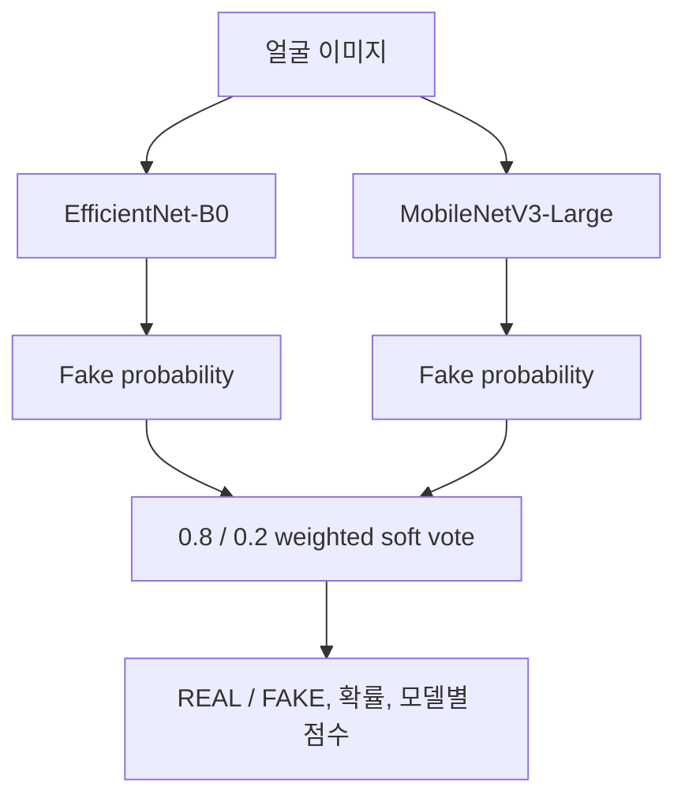

# TruthLens
## 제한된 환경의 딥페이크 탐지에서 일반화 문제를 다룬 모델링 사례

> 졸업작품의 AI 모델 파트입니다. 높은 점수 하나를 내세우기보다, 영상 프레임 데이터에서 생기기 쉬운 누수와 과적합을 찾아 평가 구조와 코드 구조를 개선했습니다.

## 한눈에 보기

| 구분 | 내용 |
| --- | --- |
| 문제 | 얼굴 기반 딥페이크 분류에서 데이터셋 밖 일반화가 쉽게 무너지는 문제 |
| 담당 범위 | 데이터 인덱싱, 모델 학습·평가, 앙상블 추론, 백엔드 연결용 Python 인터페이스 |
| 모델 | EfficientNet-B0, MobileNetV3-Large, weighted soft voting |
| 핵심 설계 | 원본 영상 그룹 단위 분할, 전이학습, regularization, validation 전용 threshold 선택 |
| 프로젝트 상태 | 교육·연구용 프로토타입 |
| 검증 기록 | DeepFake-Eval-2024 EfficientNet-B0 fine-tuning, validation ROC-AUC 0.6731 |

---

## 1. 왜 이 문제를 다시 정의했는가

딥페이크 탐지는 같은 데이터셋 안에서 높은 정확도가 나와도, 다른 압축 방식·카메라·인물·생성 기법을 만나면 성능이 크게 달라질 수 있습니다. 특히 한 원본 영상에서 추출한 프레임을 무작위로 나누면, 거의 같은 장면이 학습과 평가에 함께 들어갈 수 있습니다. 이 경우 모델은 새로운 영상에 대한 판별 능력보다 프레임의 반복 패턴을 학습할 위험이 있습니다.

그래서 이 프로젝트의 질문을 다음처럼 정리했습니다.

> 제한된 데이터와 연산 자원에서, 모델 성능을 부풀리지 않으면서 과적합을 줄이고 다음 실험으로 이어질 수 있는 평가 흐름을 만들 수 있는가?

단순히 CNN을 추가하는 것보다 **데이터 분할, 학습 절차, threshold 선택, 결과 기록**을 함께 설계하는 데 집중했습니다.

---

## 2. 내가 맡은 범위

팀 프로젝트는 프론트엔드·백엔드·AI 모델로 나뉘었고, 이 저장소는 AI 모델 파트만 다룹니다.

- 얼굴 이미지 데이터 인덱싱과 split manifest 생성
- EfficientNet-B0·MobileNetV3-Large 분류기 구성
- ImageNet 전이학습과 단계적 fine-tuning
- augmentation, Dropout, Focal Loss, weight decay, scheduler 적용
- weighted soft voting 기반 추론
- MTCNN 얼굴 크롭 및 백엔드 연결용 `DeepfakeDetectionPipeline`
- 평가·체크포인트·메타데이터 검증 코드

웹 UI, API 서버, 클라우드 배포는 팀의 다른 역할이며 이 저장소의 개인 기여로 포함하지 않습니다.

---

## 3. 데이터와 평가 구조

### 프레임 수보다 원본 영상 단위의 독립성을 우선

manifest는 이미지 파일만 나열하지 않고 데이터셋과 원본 영상 정보를 함께 보존합니다.

| 필드 | 역할 |
| --- | --- |
| `image_path` | 추출 프레임 위치 |
| `label` | REAL = 0, FAKE = 1 |
| `source_dataset` | Celeb-DF, DFDC 등 출처 구분 |
| `group_id` | 같은 원본 영상의 식별자 |
| `split` | train / validation / test |

`source_dataset + group_id`를 하나의 분할 단위로 관리합니다. 같은 그룹이 두 split에 들어가면 테스트가 실패하도록 구성했습니다. 손상 이미지를 검은 이미지로 대체하지 않고 제외하는 이유도, 인공적인 검은 패턴이 label과 결합해 새로운 편향이 되는 것을 막기 위해서입니다.


### threshold는 validation에서만 선택

기본 판정 threshold는 0.5입니다. 별도 보정이 필요하면 validation set에서 후보 값을 비교해 하나를 고정하고, test set에는 그 값을 한 번만 적용합니다. test 결과를 본 뒤 threshold를 바꾸는 흐름은 제공하지 않습니다.

---

## 4. 모델링에서 시도한 것

### 서로 다른 두 백본의 앙상블

EfficientNet-B0를 주 모델로, MobileNetV3-Large를 보조 모델로 구성했습니다. 두 모델의 fake 확률을 0.8 : 0.2로 가중 평균합니다.



이 가중치는 구현된 실험 설정입니다. 0.8 : 0.2가 최적이라는 비교 기록은 남아 있지 않으므로, 앙상블의 우수성으로 해석하지 않습니다.

### 전이학습과 단계적 fine-tuning

작은 데이터에서 전체 네트워크를 처음부터 학습하면 빠르게 암기할 수 있습니다. 새 학습은 다음 순서로 구성했습니다.

1. ImageNet 가중치로 시작하고 classifier head만 warm-up
2. 마지막 feature block과 head를 낮은 learning rate로 fine-tuning
3. 충분한 데이터와 검증 근거가 있을 때만 전체 backbone 학습

평가와 추론 경로는 checkpoint를 불러올 때 구조만 생성해, 네트워크가 없는 환경에서 ImageNet 가중치를 임의로 내려받지 않도록 했습니다.

### 과적합 완화 장치

| 시도 | 코드상 목적 |
| --- | --- |
| Dropout 0.5 | classifier head의 과도한 의존 완화 |
| AdamW weight decay | 파라미터 크기 규제 |
| augmentation | 좌우 반전, 색 변화, 회전, random erasing으로 입력 변화 제공 |
| Focal Loss | 어려운 샘플의 학습 비중 조정 |
| CosineAnnealingLR·early stopping | 불필요한 장기 학습 방지 |

각 항목의 단독 효과를 비교한 ablation 실험은 아직 없습니다. 따라서 이 표는 구현한 방어 장치이지, 각각의 성능 향상 증명은 아닙니다.

---

## 5. 보존된 실험 기록

현재 체크포인트와 연결할 수 있는 기록은 **DeepFake-Eval-2024에서 수행한 EfficientNet-B0 fine-tuning 1건**입니다.

| 항목 | 기록 |
| --- | --- |
| 시작점 | DFDC EfficientNet-B0 checkpoint |
| 학습 규모 | 최대 200개 train 영상, 영상당 8프레임 |
| 학습 설정 | 5 epochs, batch size 32, learning rate 0.0001 |
| 선택 기준 | validation ROC-AUC |
| 최고 validation ROC-AUC | **0.6731, epoch 3** |
| 해당 epoch accuracy | **0.6272** |

학습 accuracy는 0.6003에서 0.8953까지 상승했지만, validation ROC-AUC는 epoch 3 이후 0.6720과 0.6726 수준에서 정체됐고 validation loss도 증가했습니다. 더 오래 학습하는 것만으로 일반화가 개선되지 않는다는 신호로 해석했습니다.

### 이 기록으로 말할 수 있는 것

- 제한된 표본에서 전이학습과 checkpoint 선택 흐름을 구현했다.
- train과 validation의 차이를 수치로 확인했다.
- 추가 epoch보다 데이터 독립성, 다양성, 외부 평가가 중요하다는 다음 과제를 확인했다.

### 이 기록으로 말할 수 없는 것

- 앙상블이 단독 EfficientNet보다 우수하다.
- 실제 웹 이미지 전반에 안정적으로 일반화한다.
- 출력 확률이 calibration된 신뢰도다.
- Celeb-DF와 DFDC를 함께 학습한 checkpoint의 성능이다.

---

## 6. 저장소 구조와 재현성

```text
truthlens/
  config.py       학습·모델 설정
  data.py         manifest, group split, dataset
  models.py       EfficientNet / MobileNet 구성
  training.py     warm-up과 fine-tuning
  evaluation.py   지표와 threshold 선택
  ensemble.py     weighted soft voting
  pipeline.py     백엔드 연결용 추론 인터페이스
model/            기존 import 호환 어댑터
src/              index 생성, 학습, 앙상블 평가 CLI
tests/            데이터 누수·threshold·vote·smoke test
artifacts/        가중치 파일의 메타데이터와 SHA-256 manifest
```

재현성을 위해 다음을 코드로 검증합니다.

- 원본 영상 그룹이 split 사이에 섞이지 않는지
- random seed와 manifest 생성이 재현되는지
- 누락·손상 이미지가 학습 데이터에 들어가지 않는지
- freeze / unfreeze 단계와 Dropout 설정이 기대대로 적용되는지
- weighted vote의 가중치 합이 유효한지
- threshold를 validation에서 선택한 뒤 test에 고정하는지
- 기존 `model.pipeline` 호출이 새 `truthlens` 패키지와 호환되는지

대용량 가중치와 원본 데이터는 저장소에 넣지 않았습니다. 저장소에는 가중치 메타데이터와 해시만 남깁니다.

---

## 7. 실행 방법

### 환경 준비

```bash
python -m pip install -r requirements.txt
python -m pip install -r requirements-dev.txt
python -m pytest -q
```

### 데이터 인덱스 생성 예시

원본 데이터의 접근 조건과 라이선스를 먼저 확인한 뒤, 데이터 위치에 맞춰 manifest를 만듭니다.

```bash
python src/build_index.py --help
python src/train_ensemble.py --help
python src/evaluate_ensemble.py --help
```

체크포인트와 데이터셋 파일은 별도로 준비해야 합니다. 파일명만으로 추정한 학습 출처와 검증된 성능 기록은 구분합니다.

---

## 8. 다음 실험

1. 원본 영상·인물 단위 holdout을 강화하고 split별 중복 검사를 자동화
2. Celeb-DF 학습 후 DFDC 평가처럼 교차 도메인 성능을 별도 측정
3. 단독 모델과 앙상블을 여러 seed로 반복해 평균과 분산 기록
4. validation에서 앙상블 가중치를 비교하고 고정된 test에는 한 번만 적용
5. 압축률·해상도·얼굴 크기별 slice metric과 오류 사례 정리
6. 자원이 확보되면 ViT, 주파수 기반 특징, graph 기반 접근을 같은 프로토콜에서 비교

---

## 9. 사용상 주의

이 모델은 교육·연구용 프로토타입입니다. 결과를 포렌식 증거나 자동 제재 판단에 사용하면 안 됩니다. 데이터셋과 파생 가중치의 재배포·상업 이용 조건은 각각 별도로 확인해야 합니다.
